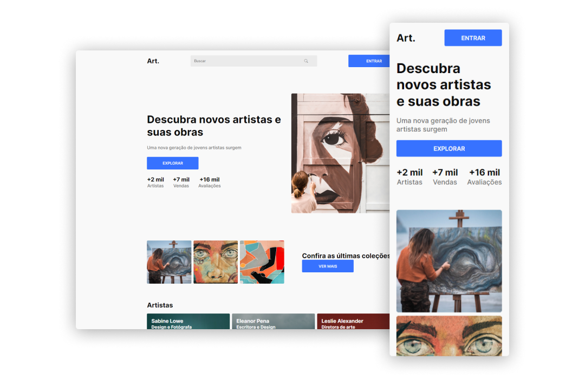

# Casos de estudo

Templates desenvolvidos para praticar meus conhecimentos com HTML, CSS e JavaScript.

Os designers que elaboraram os temas serão creditados abaixo, junto com os créditos dos arquivos externos e o link para acessar o diretório do projeto referente.
  

### Veja todos os projetos em:
[GitHub Pages](https://viniciuscosmome.github.io/casos-de-estudo/)
  

### Navegar pelo README.md
* [Blog Codelândia](#blog-codelândia)
* [Notícias Naped](#notícias-naped)
* [Art.](#art)
* [HOMEYOU](#homeyou)
  

# Blog Codelândia
>
Clique na imagem acima para visualizar o template na web

[Ver repositório Blog Codelândia](https://github.com/viniciuscosmome/casos-de-estudo/tree/master/learning/blog_codelandia)

<table align=center>
    <thead>
        <tr>
            <th>Designer do tema</th>
            <th>Ícones</th>
            <th>Fontes</th>
        </tr>
    </thead>
    <tbody>
        <tr>
            <td>iuricode</td>
            <td>Bootstrap Icons</td>
            <td>Google Fonts</td>
        </tr>
    </tbody>
</table>
  

# Notícias Naped
>
Clique na imagem acima para visualizar o template na web

[Ver repositório Notícias Naped](https://github.com/viniciuscosmome/casos-de-estudo/tree/master/learning/noticias_naped)

<table align=center>
    <thead>
        <tr>
            <th>Designer do tema</th>
            <th>Ícones</th>
            <th>Fontes</th>
        </tr>
    </thead>
    <tbody>
        <tr>
            <td>iuricode</td>
            <td>Bootstrap Icons</td>
            <td>Google Fonts</td>
        </tr>
    </tbody>
</table>
  

# Art.
>
Clique na imagem acima para visualizar o template na web

[Ver repositório Art.](https://github.com/viniciuscosmome/casos-de-estudo/tree/master/learning/website_art)

<table align=center>
    <thead>
        <tr>
            <th>Designer do tema</th>
            <th>Ícones</th>
            <th>Fontes</th>
        </tr>
    </thead>
    <tbody>
        <tr>
            <td>iuricode</td>
            <td>Bootstrap Icons</td>
            <td>Google Fonts</td>
        </tr>
    </tbody>
</table>
  

# HOMEYOU
>
Clique na imagem acima para visualizar o template na web

[Ver repositório HOMEYOU.](https://github.com/viniciuscosmome/casos-de-estudo/tree/master/learning/website_homeyou)

<table align=center>
    <thead>
        <tr>
            <th>Designer do tema</th>
            <th>Ícones</th>
            <th>Fontes</th>
        </tr>
    </thead>
    <tbody>
        <tr>
            <td>iuricode</td>
            <td>Bootstrap Icons</td>
            <td>Google Fonts</td>
        </tr>
    </tbody>
</table>
  

  

<table>
    <thead>
        <tr>
            <th align=center>Autor</th>
        </tr>
    </thead>
    <tbody>
        <tr>
            <td align=center>
                
            </td>
        </tr>
        <tr>
            <td align=center>
                <a
                    href="https://github.com/viniciuscosmome"
                    style="color: rgb(15, 110, 232);">
                    <strong>@viniciuscosmome</strong>
                </a>
            </td>
        </tr>
    </tbody>
</table>

  

    Gostou do repositório? Dá uma ⭐
     
    
        <strong>&copy; 2022 Vinicius Cosmo</strong>
    

